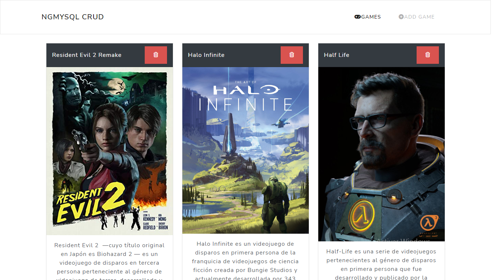
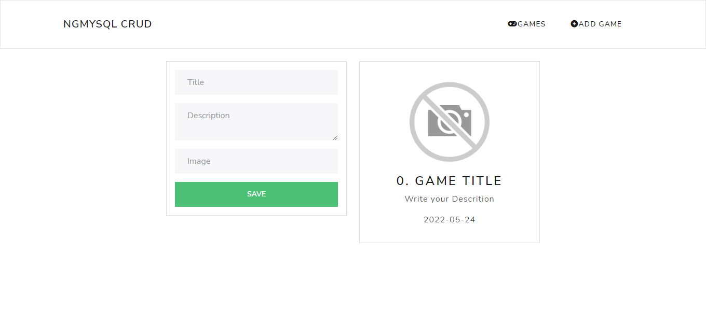

# angular-games-crud-mysql

Antes de comenzar debes tener instalado Visual studio Code, NodeJS, Git, TypeScript, Angular CLI y WampServer

Pasos para arrancar el proyecto
1) Abrir una terminal de Git y clonar el proyecto con el comando: git clone https://github.com/RickZF/angular-games-crud-mysql.git
2) Abrir WampServer luego phpMyAdmin y crear la base de datos con el archivo database/database.sql que se encuentra en el proyecto
3) Abrir la carpeta del proyecto con Visual Studio Code y abrir una terminal con ctrl+shift+ñ
4) Moverse a la carpeta server con el comando: cd server
5) Dentro de server instalar las dependencias con el comando: npm install 
6) Dentro de server activar el watch mode de TypeScript con el comando: npm run build
7) Abrir otra terminal, moverse a la carpeta server y arrancar la REST API con el comando: npm run dev
8) Abrir otra terminal (esta sería la tercera terminal abierta) moverse a la carpeta client con el comando: cd client
9) Dentro de la carpeta client escribir el comando: npm install
10) Dentro de la carpeta client arrancar el servidor de Angular con el comando: npm run start
11) Abrir el navegador Chrome y en la barra de direcciones escribir http://localhost:4200/
12) Presionar el botón ADD GAME en la barra de navegación del proyecto para agregar juegos en la base de datos